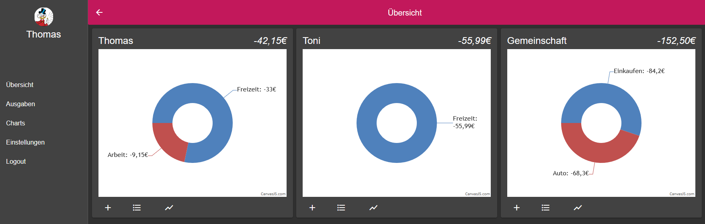
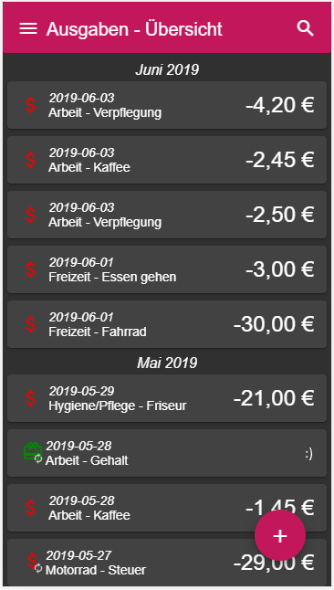
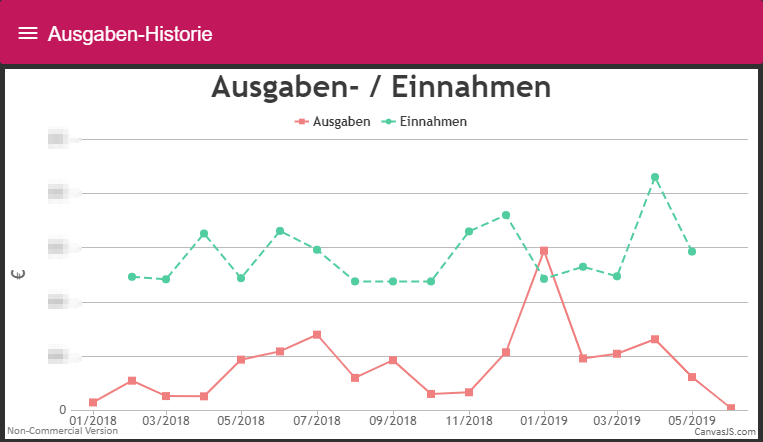
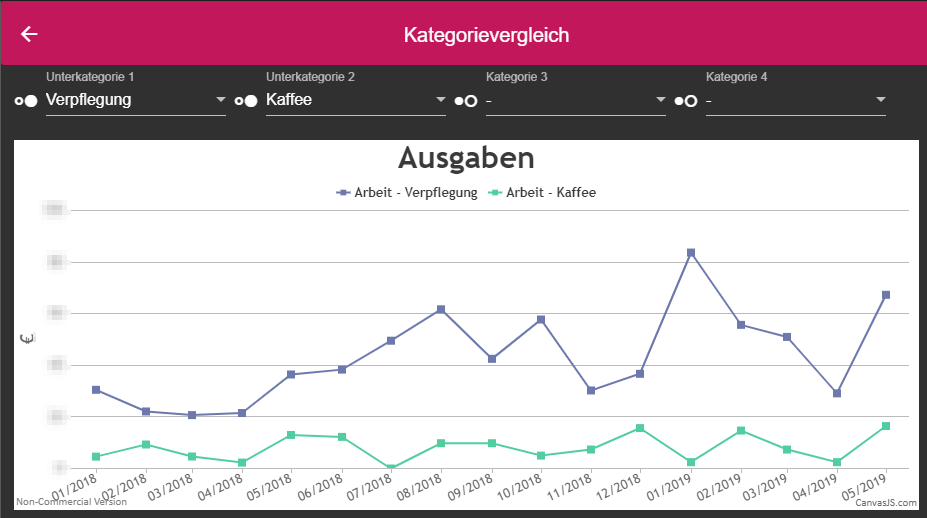
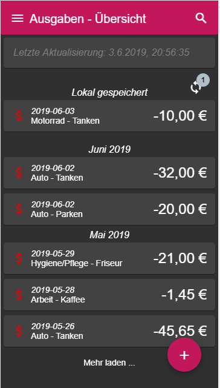

# GeldApp2

ASP.NET Core / Angular 7 playground project for expense analysis. Work in progress.

# Features

- Multi-User
- Multi-Account per user
- Accounts can be shared across users
- Responsive design for mobile, tablet and desktop use
- Charts
- Offline mode

# Screenshots

### Month-overview of a personal and two shared accounts (desktop)

### Expense tracking on mobile

### Expense history chart

### Category-Comparison chart

### Offline mode

# Technologies used in this playground:

### Serverside
- ASP.NET Core 2.2
- EF Core with Mysql-Backend
- Some Autofac for MediatR-pipelines
- Docker container for easy deployment
- SEQ for monitoring (thx for the license model!!!)
- Gitlab with NUKE & gitversion for CI/CD

### Clientside
- Angular 7 
- FxLayout for responsiveness
- Angular-Material for nice UI-controls
- Canvas.JS (thx for the license model!!!)
- Some RxJS

# Environment variables

To get it running, set the following env variables (see dev-env folder for a small docker test environment).

| Variable                               | Description	                                                                          |
| -------------------------------------- | -------------------------------------------------------------------------------------- |
| MysqlConnectionString                  | Mysql connection string, example: Server=localhost;Database=ef;User=root;Password=123; |
| AuthenticationSettings__JwtTokenSecret | JWT Token secret.                                                                      | 
| SeqTarget                              | Seq-Server target host (optional).                                                     |

You might set those values on your dev-machine with `dotnet user-secrets set MysqlConnectionString "Server=localhost;Database=geldapp;User=root;Password=xxx"`
